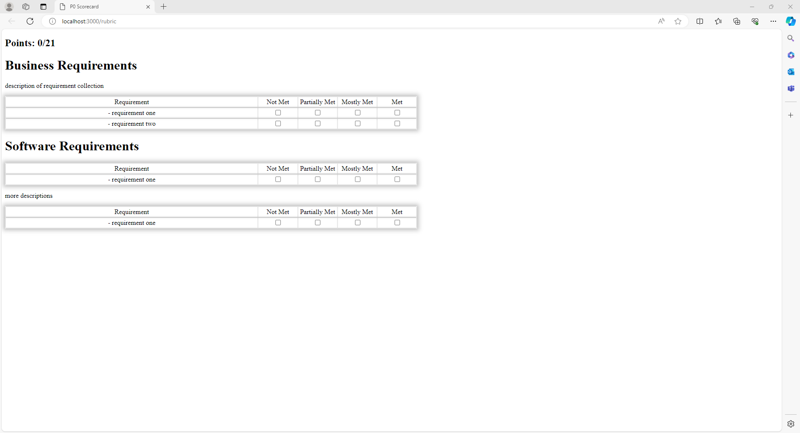

# Rubric Generator
This application is meant to be used by trainers to generate a rubric to help with grading associate projects:


The application can currently handle auto-generating and organizing the following information based off a markdown file:
- Total points that can be earned
- Points earned
- Project requirements to be assessed

Currently the application requires a markdown file in the following format:
- non-Heading level 1 header to organize collection of requirements to be assessed
- optional text to describe or provide reminders for requirements to be assessed
- list items of requirements to be assessed
```markdown
## Requirement Description
optional description or reminder of the project requirement being assessed
- thing to be assessed one
- thing to be assessed two

more descriptions or notes
- thing to be assessed three
- etc.
```

This application was designed with a project document that has all data included in a markdown file.

# TODO
- Update HTML template to be project agnostic (currently title and styling are set for hard-coded JWA P0 project)
- Index code is currently all wrapped in a self-invoking function: decoupling the code to make future adjustments easier would be ideal
- add a graceful way to stop the application
- create a self-contained executable trainers can use
- clean up extraneous code in various modules